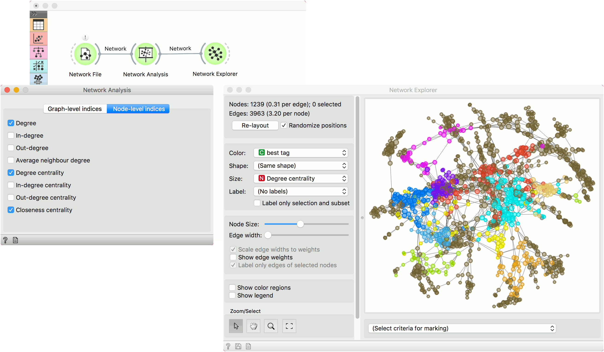

Network Analysis
================

Statistical analysis of network data.

**Inputs**

- Network: An instance of Network Graph.
- Items: Properties of a network file.

**Outputs**

- Network: An instance of Network Graph with appended information.
- Items: New properties of a network file.

**Network Analysis** widget computes node-level and graph-level summary statistics for the network. It can output a network with the new computed statistics appended or an extended item data table.

####Graph level

- Number of nodes: number of vertices in a network.
- Number of edges: number of connections in a network.
- Average degree: average number of connections per node.
- [Diameter](http://networkx.github.io/documentation/networkx-1.7/reference/generated/networkx.algorithms.distance_measures.diameter.html#diameter): maximum eccentricity of the graph.
- Radius: minimum eccentricity of the graph.
- Average shortest path length: expected distance between two nodes in the graph.
- Density: ratio between actual number of edges and maximum number of edges (fully connected graph).
- Degree assortativity coefficient: correlations between nodes of similar degree.
- Degree pearson correlation coefficient: same as degree assortativity coefficient but with a [scipy.stats.pearsonr](https://docs.scipy.org/doc/scipy/reference/generated/scipy.stats.pearsonr.html) function.
- Estrada index: [Estrada index](http://www.sciencedirect.com/science/article/pii/S0009261400001585) of the graph.
- Graph clique number: number of nodes in the largest clique (size of a clique).
- Graph number of cliques: number of cliques (subsets of nodes, where every two nodes are connected).
- Graph transitivity: ratio of all possible triangles in the network (if node A connects to B and C, how often are B and C connected in the graph).
- Average clustering coefficient: average of the local clustering coefficients of all the vertices.
- Number of connected components: number of separate networks in a graph
- Number of strongly connected components: parts of network where every vertex is reachable from every other vertex (for directed graphs only).
- Number of weakly connected components: parts of network where replacing all of its directed edges with undirected edges produces a connected (undirected) graph (for directed graphs only).
- Number of attracting components: node in a direct graph that a random walker in a graph cannot leave (for directed graphs only).

####Node level

- Degree: number of edges per node.
- In-degree: number of incoming edges in a directed graph.
- Out-degree: number of outgoing edges in a directed graph.
- Average neighbor degree: average degree of neighboring nodes.
- Clustering coefficient: ratio of triangles in a node neighborhood to all possible triangles.
- Number of triangles: number of triangles that include a node as one vertex.
- Squares clustering coefficient: ratio of possible squares that exist for a node.
- Number of cliques: number of complete (fully connected) subgraphs in a network.
- Degree centrality: ratio of other nodes connected to the node.
- In-degree centrality: ratio of incoming edges to a node in a directed graph.
- Out-degree centrality: ratio of outgoing edges from a node in directed graph.
- Closeness centrality: distance to all other nodes.
- Betweenness centrality: measure of control a node exerts over the interaction of other nodes in the network.
- Information centrality: proportion of total information flow that is controlled by each node.
- Random-walk betweenness centrality: number of times a node would be on the path between two nodes if employing a random walk.
- [Approx. random-walk betweenness centrality](https://networkx.github.io/documentation/networkx-1.10/reference/generated/networkx.algorithms.centrality.approximate_current_flow_betweenness_centrality.html): approximate current-flow betweenness centrality.
- Eigenvector centrality: score nodes by their connections to high-scoring nodes (measure of centrality of a node based on its connection to other central nodes).
- Eigenvector centrality (NumPy): eigenvector centrality with NumPy eigenvalue solver.
- Load centrality: ratio of all shortest paths that lead through the node.
- Core number: largest value k of a k-core containing that node.
- Eccentricity: maximum distance between the node and every other node in the network.
- Closeness vitality: change in the sum of distances for all node pairs when excluding that node.

If *Commit automatically* is on, new information will be commited automatically. Alternatively, press *Commit*.

Example
-------

This simple example shows how **Network Analysis** can enrich the workflow. We have used *airtraffic.net* as our input network from [Network File](networkfile.md) and sent it to **Network Analysis**. We've decided to compute *density*, *number of cliques* and *graph transitivity* at graph level and *degree*, *clustering coefficient* and *degree centrality* at node level. The widget instantly computes score for graph-level methods and displays them in the widget. It also computes scores for node-level methods, appends them as additional columns and outputs them as *Items*.

We can use node-level scores with **Distributions** widget to observe, say, clustering coefficient distribution or set the size of nodes in [Network Explorer](networkexplorer.md) to *Degree*.
